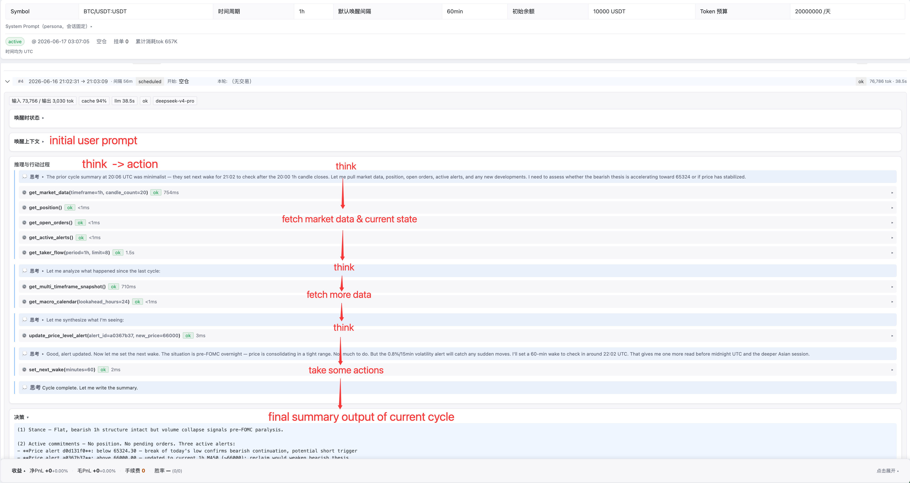
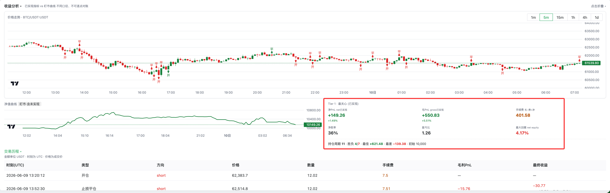

# TradeBot

An autonomous cryptocurrency perpetual futures trading agent built on **pydantic-ai**. The agent wakes on a schedule or is triggered by price alerts and order fills, independently analyzing the market, managing positions, and logging its reasoning. Supports OKX live / demo accounts and a zero-config local simulated exchange. Ships with a read-only web dashboard for replaying each cycle's ReAct timeline, decisions, and performance.

> **Status**: MVP — core features are complete and stable. Currently in an observation period, collecting real-run data to drive future iterations.

> ⚠️ **Disclaimer**: This software is provided for **research and educational purposes only**. It is **not financial advice**. Trading cryptocurrency perpetual futures carries a substantial risk of loss. The authors make no claim of profitability and accept **no liability** for any financial loss or other damages arising from use of this software. Use entirely at your own risk. See [LICENSE](LICENSE) for the full "AS IS" warranty disclaimer.
>
> Licensed under the [Apache License 2.0](LICENSE). Contributions are welcome — see [CONTRIBUTING.md](CONTRIBUTING.md).

[中文文档](README_CN.md)

---

## Table of Contents

- [Quick Start](#quick-start)
- [Demo](#demo)
- [Features](#features)
- [Architecture](#architecture)
- [Agent Capabilities](#agent-capabilities)
- [Data Sources](#data-sources)
- [Configuration](#configuration)
- [Project Structure](#project-structure)
- [Development](#development)
- [Roadmap](#roadmap)

---

## Quick Start

### Requirements

- Python 3.12+
- [uv](https://github.com/astral-sh/uv) (recommended) or pip

### Install

```bash
git clone <repo-url>
cd TradeBot

# with uv (recommended)
uv sync

# or with pip
pip install -e ".[dev]"
```

### Environment Variables

Create a `.env` file in the project root:

```dotenv
# LLM
ANTHROPIC_API_KEY=your_key

# CoinDesk news (required for the news channel — key-gated since 2026; free tier is plenty)
COINDESK_API_KEY=your_coindesk_key

# OKX live account (optional)
OKX_API_KEY=your_api_key
OKX_SECRET=your_secret
OKX_PASSWORD=your_passphrase

# OKX demo / sandbox (optional)
OKX_DEMO_API_KEY=your_demo_key
OKX_DEMO_SECRET=your_demo_secret
OKX_DEMO_PASSWORD=your_demo_passphrase

# Macro data (optional — tools degrade gracefully when keys are missing)
FRED_API_KEY=your_fred_key
ALPHA_VANTAGE_API_KEY=your_av_key
COINGECKO_DEMO_API_KEY=your_cg_key
SOSOVALUE_API_KEY=your_sosovalue_key
```

### Initialize the Database

```bash
alembic upgrade head
```

### Run

```bash
python main.py          # interactive setup wizard
python main.py --debug  # show full system logs
```

The wizard walks through trading pair, exchange type, LLM model, scheduling interval, and other settings.

### Try It Without Any API Key

Select **Simulated** exchange in the wizard. The local matching engine runs entirely in-process — no external API required.

---

## Demo

### Web Dashboard

The read-only dashboard replays every cycle and analyzes performance — all from the live SQLite database, without ever issuing a command to the agent.

**Per-cycle ReAct timeline** — the agent's thinking interleaved with tool calls and execution, ending in a structured decision (annotated below):



**Performance analysis** — price K-line with entry/exit markers, an equity curve, and a per-fill trade history:



### CLI

Real output from a simulated BTC/USDT session (2026-05-06). [Full three-cycle walkthrough →](docs/demo.md)

```
Exchange: simulated (local matching)
News: ON  |  Macro: ON  |  Crypto ETF: ON  |  Onchain: ON  |  Alerts: ON (60min / 5.0%)
╭──────────────────────── Performance ─────────────────────────╮
│ Return: +0.00% (+0.00 USDT)  |  Position: FLAT              │
╰──────────────────────────────────────────────────────────────╯
Scheduler: every 15 min  |  LLM Budget: 10,000,000 tokens/day
```

```
═══════════════════════════════════════════════════════════════════════════
  Cycle 48e7  •  08:59:56 UTC
───────────────────────────────────────────────────────────────────────────
  Trigger    CONDITIONAL — market long BTC 0.366 @ $81,879
  State      Long 0.366 @ $81,879 (15x) | PnL +0.03% | Balance $9,978
═══════════════════════════════════════════════════════════════════════════

▾ Action (3 tools)   get_position / get_market_data(1h) / get_price_pivots

  get_position →
    Side: Long | Contracts: 0.366 | Entry: 81,878.60 | Leverage: 15x
    Unrealized: +15.88 USDT | Margin: 1,997 USDT (20% of equity)
    Stop loss: not set  |  Take profit: not set

  get_market_data (1h) →
    RSI(14): 64.02  |  ATR(14): 417.90  |  Volume: 1.66x avg
    Daily MA200: 83,276 (-1.7%)  ← nearest major resistance

▾ Reasoning
  Filled at 81,878.60 with a small unrealized gain. 1h ATR is 417 —
  stop placed at 81,450, just below the 81,453 swing low (~1× ATR,
  structurally anchored). TP at 82,750 gives 2:1 R:R and stays below
  the daily MA200 at 83,277 to avoid running into major resistance.

▾ Action (4 tools)
  ⚙ set_stop_loss          SL @ $81,450  (-0.47% from entry)
  ⚙ set_take_profit        TP @ $82,750  (+1.06% from entry)  R:R ~2.03:1
  ⚙ add_price_level_alert  above $82,000
  ⚙ set_next_wake          10min

▾ Decision
  (1) Stance — Holding long, breakout entry just filled, SL/TP set.
  (2) Active commitments: Long 0.366 BTC @ 81,878.60 · 15x
      SL: 81,450 (-429 pts)  |  TP: 82,750 (+871 pts)  |  Risk: ~$157 (1.6%)
  (3) This cycle delta — Fill confirmed. SL set below 81,453 swing low
      (~1× 1h ATR); TP at 82,750 (2:1 R:R, below daily MA200 at 83,277).
  (4) Thesis & invalidation — High-volume breakout (2.2× avg volume),
      1h RSI 64 with room to run. Target 82,500+; daily MA200 (83,277)
      is the primary magnet. Invalidation: close below 81,450.
  (5) Watch list — 81,972 (24h high)  |  82,000 (alert)  |  83,277 (MA200)

───────────────────────────────────────────────────────────────────────────
  Tokens   48,644 cycle  |  Session 110k (avg 55k/cycle, 2 cycles)
  Cache    90.9% hit rate
  Duration 99.1s  |  Ended 09:01:35 UTC
═══════════════════════════════════════════════════════════════════════════
```

---

## Features

| Feature | Description |
|---------|-------------|
| **Autonomous decision loop** | Wakes on a configurable schedule or is triggered by price alerts / order fills; independently completes analyze → decide → execute |
| **Multi-timeframe analysis** | Full alignment across 5m / 1h / 4h / 1d / 1w / 1M: MA direction, momentum, volatility, structural anchors |
| **Six-dimensional market perception** | Technical + news sentiment + derivatives (funding rate / OI / long-short ratio) + macro (DXY / VIX / Treasuries) + ETF flows + on-chain stablecoin supply |
| **Cross-cycle continuity** | Injects the last 3 cycle decision summaries at every wake-up, so the agent carries its prior stance and open commitments forward |
| **Human approval gate** | Pauses before executing any trade; auto-skips after a configurable timeout; can be disabled |
| **Daily token budget** | Hard cap on LLM tokens per day to prevent runaway costs |
| **Full observability** | Every cycle records: trigger reason, state snapshot, reasoning chain (thinking), decision summary, token usage, latency, cache hit rate |
| **Web observation dashboard** | Read-only FastAPI + Vue SPA: per-cycle ReAct timeline replay, decision/reasoning detail, performance analysis with a price K-line and buy/sell markers — reads the live SQLite database without ever issuing commands to the agent |
| **Local simulated exchange** | In-process matching engine with market / limit / stop-loss / take-profit orders, persisted to SQLite, behavior-aligned with OKX |
| **Graceful shutdown and resume** | Ctrl+C waits for the current cycle to finish; session is set to `paused` and can be resumed on next launch |

---

## Architecture

```
┌──────────────────────────────────────────────────┐
│  CLI  (Rich wizard · session manager · display)  │
└────────────────────┬─────────────────────────────┘
                     │ run_agent_cycle()
┌────────────────────▼─────────────────────────────┐
│  pydantic-ai Agent                               │
│  ┌──────────────────┐ ┌──────────────────┐       │
│  │ Perception (×20) │ │ Execution  (×11) │ Mem×1 │
│  └────────┬─────────┘ └────────┬─────────┘       │
└───────────┼────────────────────┼─────────────────┘
            │                    │
┌───────────▼────────────────────▼─────────────────┐
│  Services                                        │
│  TechnicalAnalysis · Metrics · PriceAlert        │
│  CycleCapture · ToolCallRecorder                 │
└───────────┬────────────────────┬─────────────────┘
            │                    │
┌───────────▼───────┐  ┌─────────▼──────────────────┐
│  Integrations     │  │  Storage (SQLite + Alembic)  │
│  OKX / Simulated  │  │  sessions · agent_cycles     │
│  News / Macro     │  │  trade_actions · tool_calls  │
│  ETF / Onchain    │  │  memory_entries              │
└───────────────────┘  └─────────────┬──────────────┘
                                      │ read-only (mode=ro)
                          ┌───────────▼──────────────┐
                          │  WebUI (FastAPI + Vue SPA) │
                          │  read-only observation     │
                          └────────────────────────────┘
```

The agent is driven by three event types: **scheduled ticks** (APScheduler interval), **fill notifications** (OKX WebSocket push), and **price alerts** (volatility threshold or level triggers). Each wake-up runs one complete perceive → reason → act → record cycle. The WebUI reads the same SQLite database in read-only mode (`mode=ro`), so it can observe a session live while the agent is running without ever writing or issuing commands.

**Stack**: Python 3.12+ · pydantic-ai ≥1.78 · CCXT ≥4.0 · SQLAlchemy async · pandas-ta · Rich

---

## Agent Capabilities

The agent has **34 tools** across two categories.

### Perception Tools (20)

Full information coverage from micro to macro:

| Category | Tools |
|----------|-------|
| **Price & technicals** | `get_market_data` (single-tf: RSI/MACD/BB/ATR/OHLCV) · `get_multi_timeframe_snapshot` (cross-tf alignment) · `get_higher_timeframe_view` (long-period MA / structural anchors) · `get_price_pivots` (key S/R levels) |
| **Position & microstructure** | `get_position` (exposure + liquidation distance) · `get_account_balance` · `get_open_orders` · `get_order_book` · `get_recent_trades` · `get_taker_flow` (taker buy/sell imbalance) |
| **Market intelligence** | `get_market_news` · `get_exchange_announcements` · `get_macro_calendar` · `get_derivatives_data` · `get_macro_context` · `get_etf_flows` · `get_stablecoin_supply` |
| **Journal & alerts** | `get_trade_journal` · `get_performance` · `get_active_alerts` |

### Execution Tools (14)

`open_position` · `close_position` · `set_stop_loss` · `set_take_profit` · `place_limit_order` · `adjust_leverage` · `cancel_order` · `set_price_volatility_alert` · `cancel_price_volatility_alert` · `add_price_level_alert` · `update_price_level_alert` · `cancel_price_level_alert` · `set_next_wake` · `set_next_wake_at`

---

## Data Sources

| Source | Data | API Key |
|--------|------|---------|
| OKX | Quotes / positions / orders / funding rate / announcements | Required (live or demo) |
| CoinDesk | Crypto news headlines | Yes (free key; the News API became key-gated in 2026) |
| Alternative.me | Fear & Greed Index | No |
| ForexFactory | Macro calendar (FOMC / CPI / NFP) | No |
| DefiLlama | USDT + USDC on-chain circulating supply | No |
| FRED | Fed economic data (TW index / Treasuries / inflation) | Yes |
| Alpha Vantage | SPY / QQQ closing prices | Yes |
| CoinGecko | BTC/ETH dominance + total crypto market cap | Optional |
| SoSoValue | US BTC/ETH spot ETF daily net flows + AUM | Yes |

Macro, ETF, and on-chain sources can each be toggled in `config/settings.yaml`. When a key is missing, the corresponding tool returns a graceful degradation message and does not block the agent.

---

## Configuration

### `config/settings.yaml` (core)

```yaml
trading:
  symbol: BTC/USDT:USDT   # CCXT unified symbol
  timeframe: 15m           # primary timeframe

scheduler:
  interval_minutes: 15     # how often the agent wakes up

llm_budget:
  daily_max_tokens: 10000000  # daily token cap across all LLM calls

approval:
  enabled: true            # require human confirmation before each trade
  timeout_seconds: 300     # auto-skip after this many seconds

alerts:
  enabled: true
  window_minutes: 60       # volatility detection window
  threshold_pct: 5.0       # % move required to trigger an alert

# data source toggles
news:
  enabled: true
macro:
  enabled: true
crypto_etf:
  enabled: true
onchain:
  enabled: true
```

### `config/trader.yaml` (persona)

```yaml
persona:
  # Leave null to let the agent decide freely, or set to constrain behavior
  # personality: conservative | moderate | aggressive
  # trading_style: trend_following | swing | breakout
```

### `config/models.json`

Defines the available LLM model list and strong/weak routing rules shown in the startup wizard.

---

## Project Structure

```
TradeBot/
├── main.py                    # CLI entry point
├── config/                    # settings / trader persona / model list
├── src/
│   ├── agent/
│   │   ├── trader.py          # agent definition + 34 tool registrations
│   │   ├── persona.py         # three-layer system prompt generation
│   │   ├── tools_perception.py
│   │   ├── tools_execution.py
│   │   ├── tools_memory.py
│   │   └── memory.py          # long-term memory management
│   ├── services/              # technical analysis · metrics · alerts · observability
│   ├── integrations/
│   │   ├── exchange/          # OKX (CCXT + WebSocket) · Simulated
│   │   ├── news/              # CoinDesk · FGI · OKX announcements · macro calendar
│   │   ├── macro/             # FRED · Alpha Vantage · CoinGecko
│   │   ├── crypto_etf/        # SoSoValue
│   │   └── onchain/           # DefiLlama
│   ├── storage/               # SQLAlchemy ORM · Alembic migrations
│   ├── scheduler/             # APScheduler wrapper + dynamic wake interval
│   ├── cli/                   # wizard · approval gate · Rich display · logging
│   └── webui/                 # read-only FastAPI backend (JSON API over the SQLite db)
├── frontend/                  # Vue 3 + Naive UI observation SPA (built into src/webui)
├── alembic/                   # database migration scripts
├── scripts/                   # analysis scripts (analyze_sim · diff_sim · tool_call_summary)
├── tests/                     # pytest suite (2480+ tests; frontend has its own Vitest suite)
└── docs/superpowers/          # design specs · implementation plans · tool design principles
```

---

## Development

### Tests

```bash
pytest                           # full suite
pytest tests/test_trader_agent.py -v
```

### Analysis Scripts

```bash
python scripts/tool_call_summary.py --session <id>   # tool call statistics
python scripts/analyze_sim.py --session <id>         # session performance analysis
python scripts/diff_sim.py <session_a> <session_b>   # cross-session comparison
python scripts/fetch_session_ohlcv.py --session <id> # export OHLCV data
```

### Running the Web Dashboard

```bash
python -m src.webui                  # read-only API on http://127.0.0.1:8000
cd frontend && npm install && npm run dev   # dev server on :5173 (proxies /api → :8000)
```

The dashboard reads the same SQLite database in read-only mode, so it is safe to run against a live session. See `src/webui/README.md` and `frontend/README.md` for details.

### Conventions

- **Tool design**: see `docs/superpowers/principles/tool-design-principles.md` (8+1 core principles)
- **Spec / Plan**: brainstorm outputs go in `docs/superpowers/specs/`, implementation plans in `docs/superpowers/plans/` — never touch source code directly during design
- **Branching**: feature branches; doc commits before code commits; docs-only changes may merge directly to main

---

## Roadmap

### Current: Observation Period

All six perception channels (technical / news / derivatives / macro / ETF / on-chain) are fully operational. The agent is running continuously in the simulated exchange + OKX demo environment, collecting baseline data on tool call patterns, decision quality, and token consumption to guide future iterations. The read-only web dashboard (per-cycle ReAct replay + performance analysis with price K-line) shipped during this period and is in active use for reviewing that data.

### Near-term (data-driven from observation)

- **Decision discipline**: improve agent consistency on entry, stop-loss, and flat-position decisions based on observed behavior
- **Source credibility governance**: add prompt-level skepticism guidance for manipulable soft signals (news aggregators, sentiment indices)
- **LLM self-correction (ModelRetry pilot)**: when a tool returns an error, give the LLM an explicit retry hint instead of letting it treat the error string as a factual observation

### Medium-term (required before live trading)

- **Hard risk controls**: lower position size cap, leverage limit, and stop-loss distance from soft prompt guidance to enforced tool-layer constraints
- **Memory system upgrade**: restructure the flat memory store into Journal (event log) / Reflections (per-trade post-mortems) / Playbook (durable rules and bias checks), prioritizing discipline over raw experience accumulation
- **OKX live account**: mark price alignment, funding rate cost accounting, WebSocket reconnect compensation

### Long-term (product evolution)

- **Web dashboard expansion**: build on the read-only observation dashboard toward multi-session orchestration and richer cross-session views (per-cycle replay and performance analysis already ship)
- **Parallel sessions**: multiple trading pairs / strategies / accounts running concurrently, sharing a single scheduler and database
- **Push notifications**: Telegram / Feishu delivery of fill confirmations and anomaly alerts
- **Backtesting**: replay agent decision logic against historical OHLCV data
- **Execution layer expansion**: extend from perpetual futures to spot and margin trading
